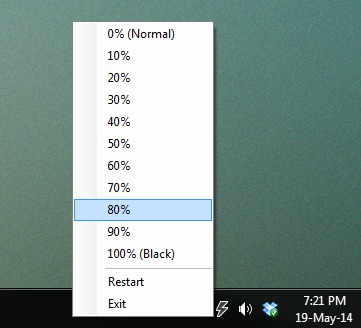

DimScreen
=========

Allows you to dim your desktop if its a bit to bright.

##Features
- Multiple monitors
- Command line support
- Smooth transitions!
- Screen dimming via hotkeys, Ctrl + NumSubtract / NumAdd
- Dimness saved to registry

